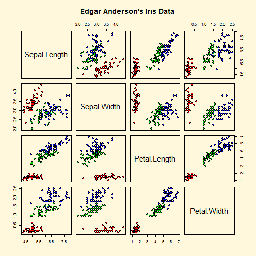
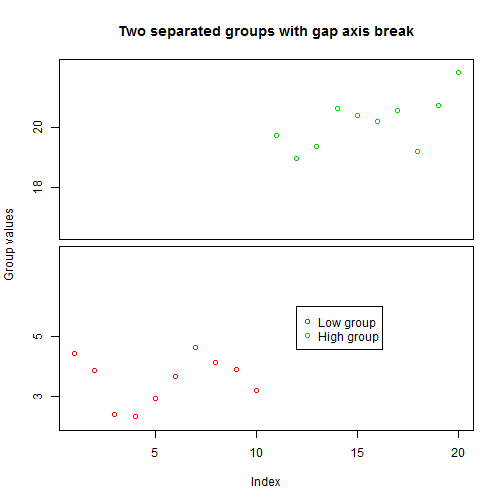
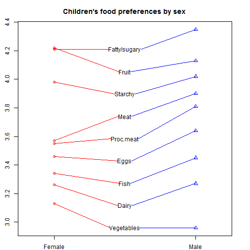

% R Graphics
% Weicheng Zhu
% 2012/06/06

  <font size = 3 color = "blue">Highly recommend you to use Chrome to read this tutorial! <br /> This tutorial is mainly for Windows users.</font>
-----------------------------------------------------------------------


# Outline

## Examples

Now we are going to one of the most attractive part of R language: **Graphics**.
First, before we actually go into it, let's enjoy the view of R graphics together :)
The purpose here is just to make you have an overall impression of the range of graphical images that can produced by R :)


```r
## R functions for base graphics
demo(graphics)
```


```
## 
## 
## 	demo(graphics)
## 	---- ~~~~~~~~
## 
## > require(datasets)
## 
## > require(grDevices); require(graphics)
## 
## > ## Here is some code which illustrates some of the differences between
## > ## R and S graphics capabilities.  Note that colors are generally specified
## > ## by a character string name (taken from the X11 rgb.txt file) and that line
## > ## textures are given similarly.  The parameter "bg" sets the background
## > ## parameter for the plot and there is also an "fg" parameter which sets
## > ## the foreground color.
## > 
## > 
## > x <- stats::rnorm(50)
## 
## > opar <- par(bg = "white")
## 
## > plot(x, ann = FALSE, type = "n")
```


```
## 
## > abline(h = 0, col = gray(.90))
## 
## > lines(x, col = "green4", lty = "dotted")
## 
## > points(x, bg = "limegreen", pch = 21)
## 
## > title(main = "Simple Use of Color In a Plot",
## +       xlab = "Just a Whisper of a Label",
## +       col.main = "blue", col.lab = gray(.8),
## +       cex.main = 1.2, cex.lab = 1.0, font.main = 4, font.lab = 3)
## 
## > ## A little color wheel.	 This code just plots equally spaced hues in
## > ## a pie chart.	If you have a cheap SVGA monitor (like me) you will
## > ## probably find that numerically equispaced does not mean visually
## > ## equispaced.  On my display at home, these colors tend to cluster at
## > ## the RGB primaries.  On the other hand on the SGI Indy at work the
## > ## effect is near perfect.
## > 
## > par(bg = "gray")
## 
## > pie(rep(1,24), col = rainbow(24), radius = 0.9)
```

 

```
## 
## > title(main = "A Sample Color Wheel", cex.main = 1.4, font.main = 3)
## 
## > title(xlab = "(Use this as a test of monitor linearity)",
## +       cex.lab = 0.8, font.lab = 3)
## 
## > ## We have already confessed to having these.  This is just showing off X11
## > ## color names (and the example (from the postscript manual) is pretty "cute".
## > 
## > pie.sales <- c(0.12, 0.3, 0.26, 0.16, 0.04, 0.12)
## 
## > names(pie.sales) <- c("Blueberry", "Cherry",
## + 		      "Apple", "Boston Cream", "Other", "Vanilla Cream")
## 
## > pie(pie.sales,
## +     col = c("purple","violetred1","green3","cornsilk","cyan","white"))
```

 

```
## 
## > title(main = "January Pie Sales", cex.main = 1.8, font.main = 1)
## 
## > title(xlab = "(Don't try this at home kids)", cex.lab = 0.8, font.lab = 3)
## 
## > ## Boxplots:  I couldn't resist the capability for filling the "box".
## > ## The use of color seems like a useful addition, it focuses attention
## > ## on the central bulk of the data.
## > 
## > par(bg="cornsilk")
## 
## > n <- 10
## 
## > g <- gl(n, 100, n*100)
## 
## > x <- rnorm(n*100) + sqrt(as.numeric(g))
## 
## > boxplot(split(x,g), col="lavender", notch=TRUE)
```

 

```
## 
## > title(main="Notched Boxplots", xlab="Group", font.main=4, font.lab=1)
## 
## > ## An example showing how to fill between curves.
## > 
## > par(bg="white")
## 
## > n <- 100
## 
## > x <- c(0,cumsum(rnorm(n)))
## 
## > y <- c(0,cumsum(rnorm(n)))
## 
## > xx <- c(0:n, n:0)
## 
## > yy <- c(x, rev(y))
## 
## > plot(xx, yy, type="n", xlab="Time", ylab="Distance")
```

 

```
## 
## > polygon(xx, yy, col="gray")
## 
## > title("Distance Between Brownian Motions")
## 
## > ## Colored plot margins, axis labels and titles.	 You do need to be
## > ## careful with these kinds of effects.	It's easy to go completely
## > ## over the top and you can end up with your lunch all over the keyboard.
## > ## On the other hand, my market research clients love it.
## > 
## > x <- c(0.00, 0.40, 0.86, 0.85, 0.69, 0.48, 0.54, 1.09, 1.11, 1.73, 2.05, 2.02)
## 
## > par(bg="lightgray")
## 
## > plot(x, type="n", axes=FALSE, ann=FALSE)
```

 

```
## 
## > usr <- par("usr")
## 
## > rect(usr[1], usr[3], usr[2], usr[4], col="cornsilk", border="black")
## 
## > lines(x, col="blue")
## 
## > points(x, pch=21, bg="lightcyan", cex=1.25)
## 
## > axis(2, col.axis="blue", las=1)
## 
## > axis(1, at=1:12, lab=month.abb, col.axis="blue")
## 
## > box()
## 
## > title(main= "The Level of Interest in R", font.main=4, col.main="red")
## 
## > title(xlab= "1996", col.lab="red")
## 
## > ## A filled histogram, showing how to change the font used for the
## > ## main title without changing the other annotation.
## > 
## > par(bg="cornsilk")
## 
## > x <- rnorm(1000)
## 
## > hist(x, xlim=range(-4, 4, x), col="lavender", main="")
```

 

```
## 
## > title(main="1000 Normal Random Variates", font.main=3)
## 
## > ## A scatterplot matrix
## > ## The good old Iris data (yet again)
## > 
## > pairs(iris[1:4], main="Edgar Anderson's Iris Data", font.main=4, pch=19)
```

 

```
## 
## > pairs(iris[1:4], main="Edgar Anderson's Iris Data", pch=21,
## +       bg = c("red", "green3", "blue")[unclass(iris$Species)])
```

 

```
## 
## > ## Contour plotting
## > ## This produces a topographic map of one of Auckland's many volcanic "peaks".
## > 
## > x <- 10*1:nrow(volcano)
## 
## > y <- 10*1:ncol(volcano)
## 
## > lev <- pretty(range(volcano), 10)
## 
## > par(bg = "lightcyan")
## 
## > pin <- par("pin")
## 
## > xdelta <- diff(range(x))
## 
## > ydelta <- diff(range(y))
## 
## > xscale <- pin[1]/xdelta
## 
## > yscale <- pin[2]/ydelta
## 
## > scale <- min(xscale, yscale)
## 
## > xadd <- 0.5*(pin[1]/scale - xdelta)
## 
## > yadd <- 0.5*(pin[2]/scale - ydelta)
## 
## > plot(numeric(0), numeric(0),
## +      xlim = range(x)+c(-1,1)*xadd, ylim = range(y)+c(-1,1)*yadd,
## +      type = "n", ann = FALSE)
```

 

```
## 
## > usr <- par("usr")
## 
## > rect(usr[1], usr[3], usr[2], usr[4], col="green3")
## 
## > contour(x, y, volcano, levels = lev, col="yellow", lty="solid", add=TRUE)
## 
## > box()
## 
## > title("A Topographic Map of Maunga Whau", font= 4)
## 
## > title(xlab = "Meters North", ylab = "Meters West", font= 3)
## 
## > mtext("10 Meter Contour Spacing", side=3, line=0.35, outer=FALSE,
## +       at = mean(par("usr")[1:2]), cex=0.7, font=3)
## 
## > ## Conditioning plots
## > 
## > par(bg="cornsilk")
## 
## > coplot(lat ~ long | depth, data = quakes, pch = 21, bg = "green3")
```

 

```
## 
## > par(opar)
```

 

```r
demo(image)
```


```
## 
## 
## 	demo(image)
## 	---- ~~~~~
## 
## > require(datasets)
## 
## > require(grDevices); require(graphics)
## 
## > x <- 10*(1:nrow(volcano)); x.at <- seq(100, 800, by=100)
## 
## > y <- 10*(1:ncol(volcano)); y.at <- seq(100, 600, by=100)
## 
## > 					# Using Terrain Colors
## > 
## > image(x, y, volcano, col=terrain.colors(100),axes=FALSE)
```


```
## 
## > contour(x, y, volcano, levels=seq(90, 200, by=5), add=TRUE, col="brown")
## 
## > axis(1, at=x.at)
## 
## > axis(2, at=y.at)
## 
## > box()
## 
## > title(main="Maunga Whau Volcano", sub = "col=terrain.colors(100)", font.main=4)
## 
## > 					# Using Heat Colors
## > 
## > image(x, y, volcano, col=heat.colors(100), axes=FALSE)
```

 

```
## 
## > contour(x, y, volcano, levels=seq(90, 200, by=5), add=TRUE, col="brown")
## 
## > axis(1, at=x.at)
## 
## > axis(2, at=y.at)
## 
## > box()
## 
## > title(main="Maunga Whau Volcano", sub = "col=heat.colors(100)", font.main=4)
## 
## > 					# Using Gray Scale
## > 
## > image(x, y, volcano, col=gray(100:200/200), axes=FALSE)
```

 

```
## 
## > contour(x, y, volcano, levels=seq(90, 200, by=5), add=TRUE, col="black")
## 
## > axis(1, at=x.at)
## 
## > axis(2, at=y.at)
## 
## > box()
## 
## > title(main="Maunga Whau Volcano \n col=gray(100:200/200)", font.main=4)
## 
## > ## Filled Contours are even nicer sometimes :
## > example(filled.contour)
## 
## flld.c> require(grDevices) # for colours
## 
## flld.c> filled.contour(volcano, color = terrain.colors, asp = 1)# simple
```

 

```
## 
## flld.c> x <- 10*1:nrow(volcano)
## 
## flld.c> y <- 10*1:ncol(volcano)
## 
## flld.c> filled.contour(x, y, volcano, color = terrain.colors,
## flld.c+     plot.title = title(main = "The Topography of Maunga Whau",
## flld.c+     xlab = "Meters North", ylab = "Meters West"),
## flld.c+     plot.axes = { axis(1, seq(100, 800, by = 100))
## flld.c+                   axis(2, seq(100, 600, by = 100)) },
## flld.c+     key.title = title(main="Height\n(meters)"),
## flld.c+     key.axes = axis(4, seq(90, 190, by = 10)))# maybe also asp=1
```

 

```
## 
## flld.c> mtext(paste("filled.contour(.) from", R.version.string),
## flld.c+       side = 1, line = 4, adj = 1, cex = .66)
## 
## flld.c> # Annotating a filled contour plot
## flld.c> a <- expand.grid(1:20, 1:20)
## 
## flld.c> b <- matrix(a[,1] + a[,2], 20)
## 
## flld.c> filled.contour(x = 1:20, y = 1:20, z = b,
## flld.c+                plot.axes={ axis(1); axis(2); points(10,10) })
```

 

```
## 
## flld.c> ## Persian Rug Art:
## flld.c> x <- y <- seq(-4*pi, 4*pi, len = 27)
## 
## flld.c> r <- sqrt(outer(x^2, y^2, "+"))
## 
## flld.c> filled.contour(cos(r^2)*exp(-r/(2*pi)), axes = FALSE)
```

 

```
## 
## flld.c> ## rather, the key *should* be labeled:
## flld.c> filled.contour(cos(r^2)*exp(-r/(2*pi)), frame.plot = FALSE,
## flld.c+                plot.axes = {})
```

  

```r
demo(persp)
```


```
## 
## 
## 	demo(persp)
## 	---- ~~~~~
## 
## > ### Demos for  persp()  plots   -- things not in  example(persp)
## > ### -------------------------
## > 
## > require(datasets)
## 
## > require(grDevices); require(graphics)
## 
## > ## (1) The Obligatory Mathematical surface.
## > ##     Rotated sinc function.
## > 
## > x <- seq(-10, 10, length.out = 50)
## 
## > y <- x
## 
## > rotsinc <- function(x,y)
## + {
## +     sinc <- function(x) { y <- sin(x)/x ; y[is.na(y)] <- 1; y }
## +     10 * sinc( sqrt(x^2+y^2) )
## + }
## 
## > sinc.exp <- expression(z == Sinc(sqrt(x^2 + y^2)))
## 
## > z <- outer(x, y, rotsinc)
## 
## > oldpar <- par(bg = "white")
## 
## > persp(x, y, z, theta = 30, phi = 30, expand = 0.5, col = "lightblue")
## 
## > title(sub=".")## work around persp+plotmath bug
## 
## > title(main = sinc.exp)
## 
## > persp(x, y, z, theta = 30, phi = 30, expand = 0.5, col = "lightblue",
## +       ltheta = 120, shade = 0.75, ticktype = "detailed",
## +       xlab = "X", ylab = "Y", zlab = "Z")
## 
## > title(sub=".")## work around persp+plotmath bug
## 
## > title(main = sinc.exp)
## 
## > ## (2) Visualizing a simple DEM model
## > 
## > z <- 2 * volcano        # Exaggerate the relief
## 
## > x <- 10 * (1:nrow(z))   # 10 meter spacing (S to N)
## 
## > y <- 10 * (1:ncol(z))   # 10 meter spacing (E to W)
## 
## > persp(x, y, z, theta = 120, phi = 15, scale = FALSE, axes = FALSE)
## 
## > ## (3) Now something more complex
## > ##     We border the surface, to make it more "slice like"
## > ##     and color the top and sides of the surface differently.
## > 
## > z0 <- min(z) - 20
## 
## > z <- rbind(z0, cbind(z0, z, z0), z0)
## 
## > x <- c(min(x) - 1e-10, x, max(x) + 1e-10)
## 
## > y <- c(min(y) - 1e-10, y, max(y) + 1e-10)
## 
## > fill <- matrix("green3", nrow = nrow(z)-1, ncol = ncol(z)-1)
## 
## > fill[ , i2 <- c(1,ncol(fill))] <- "gray"
## 
## > fill[i1 <- c(1,nrow(fill)) , ] <- "gray"
## 
## > par(bg = "lightblue")
## 
## > persp(x, y, z, theta = 120, phi = 15, col = fill, scale = FALSE, axes = FALSE)
## 
## > title(main = "Maunga Whau\nOne of 50 Volcanoes in the Auckland Region.",
## +       font.main = 4)
## 
## > par(bg = "slategray")
## 
## > persp(x, y, z, theta = 135, phi = 30, col = fill, scale = FALSE,
## +       ltheta = -120, lphi = 15, shade = 0.65, axes = FALSE)
## 
## > ## Don't draw the grid lines :  border = NA
## > persp(x, y, z, theta = 135, phi = 30, col = "green3", scale = FALSE,
## +       ltheta = -120, shade = 0.75, border = NA, box = FALSE)
## 
## > ## `color gradient in the soil' :
## > fcol <- fill ; fcol[] <- terrain.colors(nrow(fcol))
## 
## > persp(x, y, z, theta = 135, phi = 30, col = fcol, scale = FALSE,
## +       ltheta = -120, shade = 0.3, border = NA, box = FALSE)
## 
## > ## `image like' colors on top :
## > fcol <- fill
## 
## > zi <- volcano[ -1,-1] + volcano[ -1,-61] +
## +            volcano[-87,-1] + volcano[-87,-61]  ## / 4
## 
## > fcol[-i1,-i2] <-
## +     terrain.colors(20)[cut(zi,
## +                            stats::quantile(zi, seq(0,1, length.out = 21)),
## +                            include.lowest = TRUE)]
## 
## > persp(x, y, 2*z, theta = 110, phi = 40, col = fcol, scale = FALSE,
## +       ltheta = -120, shade = 0.4, border = NA, box = FALSE)
## 
## > ## reset par():
## > par(oldpar)
```

 

```r
require(plotrix)
```


```
## Loading required package: plotrix
```


```r
demo(plotrix)
```


```
## 
## 
## 	demo(plotrix)
## 	---- ~~~~~~~
## 
## > # The plotrix demo in roughly alphabetical order
## > # Press <Enter> to advance through the demo,
## > # Ctrl-C (Linux) or Esc (Windows) to exit
## > par(ask=TRUE)
## 
## > x <- rnorm(100)
## 
## > y <- x + rnorm(100)
## 
## > lmfit <- lm(y~x)
## 
## > plot(x,y,xlim=c(-3.5,3.5),main="Ablineclip")
```


```
## 
## > ablineclip(lmfit,x1=-2,x2=2,lty=2)
## 
## > ablineclip(h=0,x1=-2,x2=2,lty=3,col="red")
## 
## > ablineclip(v=0,y1=-2.5,y2=1.5,lty=4,col="green")
## 
## > testdf<-data.frame(Before=c(10,7,5),During=c(8,6,2),After=c(5,3,4))
## 
## > rownames(testdf)<-c("Red","Green","Blue")
## 
## > barp(testdf,main="Test addtable2plot",ylab="Value",
## +  names.arg=colnames(testdf),col=2:4)
```

 

```
## 
## > addtable2plot(2,8,testdf,bty="o",display.rownames=TRUE,hlines=TRUE,
## +  title="The table")
## 
## > plot(0,xlim=c(1,5),ylim=c(1,5),main="Arctext",xlab="",ylab="",
## +  type="n")
```

 

```
## 
## > arctext("bendy like spaghetti",center=c(3,3),col="blue")
## 
## > arctext("bendy like spaghetti",center=c(3,3),radius=1.5,start=pi,cex=2)
## 
## > arctext("bendy like spaghetti",center=c(3,3),radius=0.5,
## +  start=pi/2,stretch=1.2)
## 
## > plot(3:10,main="Axis break test")
```

 

```
## 
## > # put a break at the default axis and position
## > axis.break()
## 
## > axis.break(2,2.9,style="zigzag")
## 
## > twogrp<-c(rnorm(10)+4,rnorm(10)+20)
## 
## > gap.plot(twogrp,gap=c(8,16),xlab="Index",ylab="Group values",
## +  main="Two separated groups with gap axis break",
## +  col=c(rep(2,10),rep(3,10)),ytics=c(3,5,18,20))
```

 

```
## 
## > legend(12,6,c("Low group","High group"),pch=1,col=2:3)
## 
## > plot(1:10*0.001,1:10*100,axes=FALSE,xlab="",ylab="",main="Axis multipliers")
```

 

```
## 
## > box()
## 
## > axis.mult(1,mult=0.001)
## 
## > axis.mult(2,mult=100)
## 
## > par(mar=c(5,5,4,2))
## 
## > test.df<-data.frame(Age=rnorm(100,25,10),
## +  Sex=sample(c("M","F"),100,TRUE),
## +  Marital=sample(c("M","X","S","W"),100,TRUE),
## +  Employ=sample(c("FT","PT","NO"),100,TRUE))
## 
## > test.col<-list(Overall="green",Employ=c("purple","orange","brown"),
## +  Marital=c("#1affd8","#caeecc","#f7b3cc","#94ebff"),Sex=c(2,4))
## 
## > barNest(formula=Age~Employ+Marital+Sex,data=test.df,main="barNest",
## +  col=test.col,showall=TRUE)
```

 

```
## 
## > happyday<-data.frame(Monday=c(2.3,3.4),Tuesday=c(2.8,3.3),Wednesday=c(3.2,3.1),
## + Thursday=c(3.6,2.8),Friday=c(4.2,2.6),Saturday=c(4.5,2.9),Sunday=c(4.1,2.8))
## 
## > happylabels<-c("Utterly dashed","Rather mopey","Indifferent","Somewhat elated",
## +  "Euphoric")
## 
## > barp(happyday,names.arg=names(happyday),legend.lab=c("Slaves","Unemployed"),
## +  legend.pos=list(x=2,y=4.5),col=c("#ee7700","#3333ff"),
## +  main="Test of barp, staxlab and color.legend",
## +  xlab="Day of week",ylab="Happiness rating",ylim=c(1,5),staxx=TRUE,staxy=TRUE,
## +  height.at=1:5,height.lab=happylabels,cex.axis=0.9,cylindrical=TRUE,
## +  shadow=TRUE)
```

 

```
## 
## > par(mar=c(5,4,4,2))
## 
## > h1<-table(cut(rnorm(100,4),breaks=seq(0,8,by=2)))
## 
## > h2<-table(cut(rnorm(100,4),breaks=seq(0,8,by=2)))
## 
## > h3<-table(cut(rnorm(100,4),breaks=seq(0,8,by=2)))
## 
## > hmat<-matrix(c(h1,h2,h3),nrow=3,byrow=TRUE)
## 
## > barp(hmat,names.arg=names(h1),width=0.45,col=2:4,
## +  main="Multiple histogram using barp",xlab="Bins",ylab="Frequency")
```

 

```
## 
## > legend(3.8,50,c("h1","h2","h3"),fill=2:4)
## 
## > x<-rnorm(10)
## 
## > y<-rnorm(10)
## 
## > plot(x,y,type="p",main="Boxed.labels")
```

 

```
## 
## > nums<-c("one","two","three","four","five","six","seven","eight","nine","ten")
## 
## > boxed.labels(x,y-0.1,nums)
## 
## > test.df<-data.frame(a=rnorm(80)+4,b=rnorm(80)+4,c=rep(LETTERS[1:4],each=20),
## +  d=rep(rep(letters[1:4],each=4),5))
## 
## > bp<-brkdn.plot("a","c","d",test.df,main="Test of brkdn.plot",
## +  mct="median",md="mad",xlab="Temperature range", ylab="Cognition",
## +  xaxlab=c("10-15","16-20","21-25","25-30"),pch=1:4,lty=1:4,col=1:4,ylim=c(0,6))
```

 

```
## 
## > legend(1,2.5,legend=c("Sydney","Gosford","Karuah","Brisbane"),pch=1:4,
## +  col=1:4,lty=1:4,xjust=0.5,yjust=0.5)
## 
## > educattn<-matrix(c(90.4,90.3,75.7,78.9,66,71.8,70.5,70.4,68.4,67.9,
## +  67.2,76.1,68.1,74.7,68.5,72.4,64.3,71.2,73.1,77.8),ncol=2,byrow=TRUE)
## 
## > rownames(educattn)<-c("Anchorage AK","Boston MA","Chicago IL",
## +  "Houston TX","Los Angeles CA","Louisville KY","New Orleans LA",
## +  "New York NY","Philadelphia PA","Washington DC")
## 
## > colnames(educattn)<-c(1990,2000)
## 
## > bumpchart(educattn,rank=FALSE,
## +  main="Percentage high school completion by over 25s",col=rainbow(10))
```

 

```
## 
## > # margins have been reset, so use
## > par(xpd=TRUE)
## 
## > boxed.labels(1.5,seq(65,90,by=5),seq(65,90,by=5))
## 
## > par(xpd=FALSE)
## 
## > testcp<-list("",40)
## 
## > for(i in 1:40) testcp[[i]]<-rnorm(sample(1:8,1)*50)
## 
## > segs<-get.segs(testcp)
## 
## > centipede.plot(segs,main="Centipede plot",vgrid=0)
```

 

```
## 
## > xy.mat<-cbind(sample(1:10,200,TRUE),sample(1:10,200,TRUE))
## 
## > clusteredpoints<-
## +  cluster.overplot(xy.mat,col=rep(c("red","green"),each=100))
```

 

```
## 
## > plot(clusteredpoints,col=clusteredpoints$col,
## +  main="Cluster overplot test")
```

 

```
## 
## > xy.mat<-cbind(sample(1:10,200,TRUE),sample(1:10,200,TRUE))
## 
## > count.overplot(xy.mat,main="Count overplot test",
## +  xlab="X values",ylab="Y values")
```

  

```
## 
## >  par(mar=c(7,4,4,6))
## 
## > testcol<-color.gradient(c(0,1),0,c(1,0),nslices=5)
## 
## > col.labels<-c("Cold","Warm","Hot")
## 
## > color2D.matplot(matrix(rnorm(100),nrow=10),c(1,0),0,c(0,1),
## +  main="Test color2D.matplot with color.legend")
```

 

```
## 
## > color.legend(11,6,11.8,9,col.labels,testcol,gradient="y")
## 
## > color.legend(10.2,2,11,5,col.labels,testcol,align="rb",gradient="y")
## 
## > color.legend(0.5,-2,3.5,-1.2,col.labels,testcol)
## 
## > color.legend(7,-1.8,10,-1,col.labels,testcol,align="rb",col=testcol[c(1,3,5)])
## 
## > par(mar=c(5,4,4,2))
## 
## > x<-c(0,cumsum(rnorm(99)))
## 
## > y<-c(0,cumsum(rnorm(99)))
## 
## > xydist<-sqrt(x*x+y*y)
## 
## > plot(x,y,main="Random walk plot (color.scale.lines)",xlab="X",ylab="Y",type="n")
```

 

```
## 
## > color.scale.lines(x,y,c(1,1,0),0,c(0,1,1),colvar=xydist,lwd=2)
## 
## > boxed.labels(x,y,labels=1:100,border=FALSE,cex=0.5)
## 
## > testlen<-rnorm(24)*2+5
## 
## > testpos<-0:23+rnorm(24)/4
## 
## > clock24.plot(testlen[7:19],testpos[7:19],
## +  main="Test Clock24 daytime (symbols)",
## +  point.col="blue",rp.type="s",lwd=3)
```

 

```
## 
## > par(mar=c(5,4,4,2))
## 
## > x<-seq(1,100)
## 
## > y<-sin(x/5)+x/20
## 
## > clplot(x,y,main="Clplot")
```

 

```
## 
## > x<-list(runif(90,1,2),factor(sample(LETTERS,100,TRUE)),rnorm(80,mean=5))
## 
## > dendroPlot(x,breaks=list(seq(1,2,by=0.1),0,0:10),nudge=c(0.03,0.3),
## +  xlab="Groups",ylab="Counts",main="Test dendroPlot")
```

 

```
## 
## > data(mtcars)
## 
## > mysubset<-mtcars[substr(dimnames(mtcars)[[1]],1,1)=="M",c("mpg","hp","wt","disp")]
## 
## > diamondplot(mysubset,name="Diamondplot")
```

 

```
## 
## > plot(1:10, asp = 1,main="Test draw.arc")
```

 

```
## 
## > draw.arc(5, 5, 1:10/10, deg2 = 1:10*10, col = "blue")
## 
## > draw.arc(8, 8, 1:10/10, deg2 = 1:10*10, col = 1:10)
## 
## > plot(1:5,seq(1,10,length=5),type="n",xlab="",ylab="",main="Test draw.circle")
```

 

```
## 
## > draw.circle(2,4,c(1,0.66,0.33),border="purple",
## +  col=c("#ff00ff","#ff77ff","#ffccff"),lty=1,lwd=1)
## 
## > draw.circle(2.5,8,0.6,border="red",lty=3,lwd=3)
## 
## > draw.circle(4,3,0.7,border="green",lty=1,lwd=1)
## 
## > draw.circle(3.5,7,0.8,border="blue",lty=2,lwd=2)
## 
## > x<-rnorm(10)
## 
## > y<-rnorm(10)
## 
## > plot(x,y,main="Find the empty space",xlab="X",ylab="Y")
```

 

```
## 
## > es<-emptyspace(x,y)
## 
## > boxed.labels(es,labels="Here is the\nempty space")
## 
## > iucn.df<-data.frame(area=c("Africa","Asia","Europe","N&C America",
## +  "S America","Oceania"),threatened=c(5994,7737,1987,4716,5097,2093))
## 
## > fan.plot(iucn.df$threatened,max.span=pi,
## +  labels=paste(iucn.df$area,iucn.df$threatened,sep="-"),
## +  main="Threatened species by geographical area (fan.plot)",ticks=276)
```

 

```
## 
## > feather.plot(0.6+rnorm(8)/5,seq(0,7*pi/4,by=pi/4),1:8,
## +  main="Test of feather.plot",xlab="Time",ylab="Value")
```

 

```
## 
## > plot(1:5,type="n",main="Floating Pie test",xlab="",ylab="",axes=FALSE)
```

 

```
## 
## > box()
## 
## > polygon(c(0,0,5.5,5.5),c(0,3,3,0),border="#44aaff",col="#44aaff")
## 
## > floating.pie(1.7,3,c(2,4,4,2,8),radius=0.5,
## +  col=c("#ff0000","#80ff00","#00ffff","#44bbff","#8000ff"))
## 
## > floating.pie(3.1,3,c(1,4,5,2,8),radius=0.5,
## +  col=c("#ff0000","#80ff00","#00ffff","#44bbff","#8000ff"))
## 
## > floating.pie(4,1.5,c(3,4,6,7),radius=0.5,
## +  col=c("#ff0066","#00cc88","#44bbff","#8000ff"))
## 
## > draw.circle(3.9,2.1,radius=0.04,col="white")
## 
## > draw.circle(3.9,2.1,radius=0.04,col="white")
## 
## > draw.circle(3.9,2.1,radius=0.04,col="white")
## 
## > draw.circle(4,2.3,radius=0.04,col="white")
## 
## > draw.circle(4.07,2.55,radius=0.04,col="white")
## 
## > draw.circle(4.03,2.85,radius=0.04,col="white")
## 
## > text(c(1.7,3.1,4),c(3.7,3.7,3.7),c("Pass","Pass","Fail"))
## 
## > Ymd.format<-"%Y/%m/%d"
## 
## > gantt.info<-list(labels=
## +  c("First task","Second task","Third task","Fourth task","Fifth task"),
## +  starts=
## +  as.POSIXct(strptime(
## +  c("2004/01/01","2004/02/02","2004/03/03","2004/05/05","2004/09/09"),
## +  format=Ymd.format)),
## +  ends=
## +  as.POSIXct(strptime(
## +  c("2004/03/03","2004/05/05","2004/05/05","2004/08/08","2004/12/12"),
## +  format=Ymd.format)),
## +  priorities=c(1,2,3,4,5))
## 
## > vgridpos<-as.POSIXct(strptime(c("2004/01/01","2004/02/01","2004/03/01",
## +  "2004/04/01","2004/05/01","2004/06/01","2004/07/01","2004/08/01",
## +  "2004/09/01","2004/10/01","2004/11/01","2004/12/01"),format=Ymd.format))
## 
## > vgridlab<-
## +  c("Jan","Feb","Mar","Apr","May","Jun","Jul","Aug","Sep","Oct","Nov","Dec")
## 
## > gantt.chart(gantt.info,main="Calendar date Gantt chart (2004)",
## +  priority.legend=TRUE,vgridpos=vgridpos,vgridlab=vgridlab,hgrid=TRUE)
```

 

```
## 
## > twogrp<-c(rnorm(10)+4,rnorm(10)+20)
## 
## > gap.barplot(twogrp,gap=c(8,16),xlab="Index",ytics=c(3,6,17,20),
## +  ylab="Group values",main="gap.barplot")
```

 

```
## 
## > twovec<-list(vec1=c(rnorm(30),-6),vec2=c(sample(1:10,40,TRUE),20))
## 
## > gap.boxplot(twovec,gap=list(top=c(12,18),bottom=c(-5,-3)),
## +  main="Test gap.boxplot")
```

 

```
## 
## > twogrp<-c(rnorm(5)+4,rnorm(5)+20,rnorm(5)+5,rnorm(5)+22)
## 
## > gpcol<-c(2,2,2,2,2,3,3,3,3,3,4,4,4,4,4,5,5,5,5,5)
## 
## > gap.plot(twogrp,gap=c(8,16),xlab="Index",ylab="Group values",
## +  main="Test gap.plot",col=gpcol)
```

 

```
## 
## > plot(0:10,type="n",axes=FALSE,main="gradient.rect")
```

 

```
## 
## > gradient.rect(1,0,3,6,reds=c(1,0),
## +  greens=c(seq(0,1,length=10),seq(1,0,length=10)),
## +  blues=c(0,1),gradient="y")
## 
## > gradient.rect(4,0,6,6,c(seq(0,1,length=10),rep(1,10)),
## +  c(rep(1,10),seq(1,0,length=10)),c(0,0),gradient="y")
## 
## > gradient.rect(7,0,9,6,col=smoothColors("red",38,"blue"),border=NA)
## 
## > druguse<-matrix(c(sample(c(0,1),200,TRUE),
## +  sample(c(0,1),200,TRUE),
## +  sample(c(0,1),200,TRUE),
## +  sample(c(0,1),200,TRUE)),ncol=4)
## 
## > colnames(druguse)<-c("Alc","Tob","THC","Amp")
## 
## > druglist<-makeIntersectList(druguse)
## 
## > intersectDiagram(druglist)
```

 

```
## 
## > testmat<-matrix(c(runif(50),sample(1:50,50),rnorm(50)+5,
## +  sin(1:50)),ncol=50,byrow=TRUE)
## 
## > kiteChart(testmat,varlabels=c("Uniform","Sample","Normal","Sine"),
## +  timepos=seq(1:50,by=5))
```

 

```
## Warning message: the condition has length > 1 and only the first element will be used
```


```
## Warning message: the condition has length > 1 and only the first element will be used
```


```
## Warning message: the condition has length > 1 and only the first element will be used
```


```
## 
## > didf<-data.frame(subject=1:50,interv=rep(c("therapist","ex-drinker"),each=25),
## +  outcome=sample(c("more","less"),50,TRUE))
## 
## > didf.tab<-table(didf$interv,didf$outcome)
## 
## > didf2<-c(74,46,200)
## 
## > didf3<-c(33,87,500)
## 
## > x<-list(didf.tab,didf2,didf3)
## 
## > labbecol<-list("red","green","blue")
## 
## > labbePlot(x,main="Ex-drinkers vs therapists",
## +  xlab="Percent reduced drinking (ex-drinkers)",
## +  ylab="Percent reduced drinking (therapists)",
## +  labels=list("A","B52","X117"),col=labbecol)
```

 

```
## 
## > l <- list(runif(10)*10,1:10,c(1,1,1,1,4,8))
## 
## > multhist(l,main="Test of multhist")
```

 

```
## 
## > windagg<-matrix(c(8,0,0,0,0,0,0,0,4,6,2,1,6,3,0,4,2,8,5,3,5,2,1,1,
## +  5,5,2,4,1,4,1,2,1,2,4,0,3,1,3,1),nrow=5,byrow=TRUE)
## 
## > oz.windrose(windagg,legend.pos=-26,main="Australian BoM wind rose")
```

 

```
## NULL
## 
## > y<-runif(8)
## 
## > oldpar<-panes()
## 
## > boxplot(y,axes=FALSE)
```

 

```
## 
## > box()
## 
## > tab.title("Boxplot of y",tab.col="#88dd88")
## 
## > barplot(y,axes=FALSE,col=2:9)
```


```
## 
## > box()
## 
## > tab.title("Barplot of y",tab.col="#88dd88")
## 
## > pie(y,col=2:9)
```


```
## 
## > tab.title("Pie chart of y",tab.col="#88dd88")
## 
## > box()
## 
## > plot(y,xaxs="i",xlim=c(0,9),axes=FALSE,col=2:9)
```


```
## 
## > box()
## 
## > tab.title("Scatterplot of y",tab.col="#88dd88")
## 
## > # center the title at the left edge of the last plot
## > mtext("Test of panes function",at=0,side=1,line=0.8,cex=1.5)
## 
## > par(oldpar)
## 
## > pieval<-c(2,4,6,8)
## 
## > pielabels<-
## +  c("We hate\n pies","We oppose\n  pies","We don't\n  care","We just love pies")
## 
## > pie3D(pieval,radius=0.9,labels=pielabels,explode=0.1,main="3D PIE OPINIONS")
```

 

```
## 
## > sex<-sample(c("M","F"),100,TRUE)
## 
## > hair<-sample(c("Blond","Black","Brown","Red"),100,TRUE)
## 
## > eye<-sample(c("Blue","Black","Brown","Green"),100,TRUE)
## 
## > charac<-data.frame(sex=sex,hair=hair,eye=eye)
## 
## > characlist<-makeDendrite(charac)
## 
## > plot.dendrite(characlist,names(charac),
## +  main="Dendrogram of sex, hair and eye color",cex=0.8)
```

 

```
## 
## > xy.pop<-c(3.2,3.5,3.6,3.6,3.5,3.5,3.9,3.7,3.9,3.5,3.2,2.8,2.2,1.8,
## +  1.5,1.3,0.7,0.4)
## 
## > xx.pop<-c(3.2,3.4,3.5,3.5,3.5,3.7,4,3.8,3.9,3.6,3.2,2.5,2,1.7,1.5,
## +  1.3,1,0.8)
## 
## > agelabels<-c("0-4","5-9","10-14","15-19","20-24","25-29","30-34",
## +  "35-39","40-44","45-49","50-54","55-59","60-64","65-69","70-74",
## +  "75-79","80-44","85+")
## 
## > mcol<-color.gradient(c(0,0,0.5,1),c(0,0,0.5,1),c(1,1,0.5,1),18)
## 
## > fcol<-color.gradient(c(1,1,0.5,1),c(0.5,0.5,0.5,1),c(0.5,0.5,0.5,1),18)
## 
## > par(mar=pyramid.plot(xy.pop,xx.pop,labels=agelabels,
## +  main="Australian population pyramid 2002",lxcol=mcol,rxcol=fcol,
## +  gap=0.5,show.values=TRUE))
```

 

```
## 
## > posmat<-matrix(sample(2:9,30,TRUE),nrow=3)
## 
## > radial.plot(posmat,labels=paste("X",1:10,sep=""),rp.type="p",
## +  main="Spiderweb plot (radial.plot)",line.col=2:4,show.grid=FALSE,lwd=1:3,
## +  radial.lim=c(0,10))
```

 

```
## 
## > x <- runif(20)
## 
## > y <- runif(20)
## 
## > revaxis(x,y,yside=4,main="Test revaxis")
```

 

```
## 
## > x <- c(0.1,0.1,0.1,0.1,0.1,0.2,0.2,0.2,0.2,0.3,0.3)
## 
## > y <- c( 1,  1,  1,  1,  2,  2,  2,  3,  3,  4,  5 )
## 
## > plot(x,y)
```

 

```
## 
## > sizeplot(x,y,main="sizeplot")
```

 

```
## 
## > cat1<-sample(c("None","Low","Medium","High"),40,TRUE)
## 
## > cat2<-sample(c("None","Low","Medium","High"),40,TRUE)
## 
## > cat3<-sample(c("None","Low","Medium","High"),40,TRUE)
## 
## > hcats<-data.frame(cat1,cat2,cat3)
## 
## > bhcol<-list(c("#ff8080","#dddd80","#80ff80","#8080ff"),
## +  c("red","green","lightblue","yellow"),
## +  c("#ffffff","#bbbbbb","#999999","#666666"))
## 
## > sizetree(hcats,col=bhcol,main="sizetree (hierarchical count chart)")
```

 

```
## 
## > soils.sw.percent<-data.frame(
## +  Sand=c(67,67,66,67,36,25,24,59,27,9,8,8,20,
## +  45,50,56,34,29,39,41,94,98,97,93,96,99),
## +  Silt=c(17,16,9,8,39,48,54,27,46,70,68,68,66,
## +  34,30,24,48,53,46,48,2,2,2,4,1,1),
## +  Clay=c(16,17,25,25,25,27,22,14,27,21,24,24,
## +  14,21,20,20,18,18,15,11,4,0,1,3,3,0))
## 
## > soils.sw.cols <- c(1, 1, 1, 1, 2, 2, 2, 2, 2, 3, 3,
## +  3, 3, 4, 4, 4, 5, 5, 5, 5, 6, 6, 6, 6, 6, 6)
## 
## > soils.sw.names <- c("Ardington","Astrop","Atrim",
## +  "Banbury","Beacon","Beckfoot")
## 
## > soil.texture.uk(soils.sw.percent,
## +  main = "Ternary Diagram for Some Soils from South West England",
## +  col.lines = "black", col.names = "black", show.grid = TRUE,
## +  col.grid = "blue", lty.grid = 2,  pch = 16, cex = 1.0,
## +  col.symbols = soils.sw.cols, h1 = NA, h3 = NA, t1 = NA,
## +  t3 = NA , lwduk = 2, xpos = NA, ypos = NA,
## +  snames = NA, cexuk = 1.1)
```

  

```
## 
## > legend("topleft", legend = soils.sw.names, col = 1:max(soils.sw.cols),
## +  pch = 16, cex = 1.1, title = "Location", bty = "n")
## 
## > fpkids<-data.frame(Food=c("Fatty/sugary","Fruit","Starchy","Meat",
## +  "Proc.meat","Eggs","Fish","Dairy","Vegetables"),
## +  Female=c(4.21,4.22,3.98,3.57,3.55,3.46,3.34,3.26,3.13),
## +  Male=c(4.35,4.13,4.02,3.9,3.81,3.64,3.45,3.27,2.96))
## 
## > plot(rep(1,9),fpkids$Female,xlim=c(0.8,2.2),
## +  ylim=range(c(fpkids$Female,fpkids$Male)),xlab="Sex",xaxt="n",
## +  ylab="Mean preference rating",main="Children's food preferences by sex",
## +  col="red")
```

 

```
## 
## > axis(1,at=1:2,labels=c("Female","Male"))
## 
## > points(rep(2,9),fpkids$Male,col="blue",pch=2)
## 
## > spread.labels(rep(1:2,each=9),c(fpkids$Female,fpkids$Male),
## +  fpkids$Food,between=TRUE,linecol=c("red","blue"))
## 
## > testx<-matrix(abs(rnorm(100)),nrow=10)
## 
## > stackpoly(matrix(cumsum(testx),nrow=10),main="Test Stackpoly I",
## +  xaxlab=c("One","Two","Three","Four","Five",
## +  "Six","Seven","Eight","Nine","Ten"),border="black",staxx=TRUE)
```

 

```
## 
## > sample_size<-c(500,-72,428,-94,334,-45,289)
## 
## > totals<-c(TRUE,FALSE,TRUE,FALSE,TRUE,FALSE,TRUE)
## 
## > labels<-c("Contact list","Uncontactable","","Declined","","Ineligible",
## +  "Final sample")
## 
## > staircase.plot(sample_size,totals,labels,
## +  main="Acquisition of the sample (staircase.plot)",
## +  total.col="gray",inc.col=2:4,bg.col="#eeeebb",direction="s")
```

 

```
## 
## > x<-rnorm(20)
## 
## > y<-rnorm(20)
## 
## > xlim<-range(x)
## 
## > xspace<-(xlim[2]-xlim[1])/20
## 
## > xlim<-c(xlim[1]-xspace,xlim[2]+xspace)
## 
## > ylim<-range(y)
## 
## > yspace<-(ylim[2]-ylim[1])/20
## 
## > ylim<-c(ylim[1]-yspace,ylim[2]+yspace)
## 
## > plotlabels<-
## +  c("one","two","three","four","five","six","seven","eight","nine","ten",
## +  "eleven","twelve","thirteen","fourteen","fifteen","sixteen","seventeen",
## +  "eighteen","nineteen","twenty")
## 
## > plot(x=x,y=y,xlim=xlim,ylim=ylim,main="Test thigmophobe.labels")
```

 

```
## 
## > thigmophobe.labels(x,y,plotlabels,col=c(2:6,8:12))
## 
## > data(soils)
## 
## > triax.retval<-triax.plot(soils[1:6,],main="Test triax.plot",
## +  show.grid=TRUE,show.legend=TRUE,col.symbols=1:6,pch=4)
```

 

```
## 
## > par(triax.retval$oldpar)
## 
## > twoord.plot(2:10,seq(3,7,by=0.5)+rnorm(9),
## +  1:15,rev(60:74)+rnorm(15),xlab="Sequence",
## +  ylab="Ascending values",rylab="Descending values")
```

 

```
## 
## > tab.title("Test of twoord.plot and tab.title",tab.col="yellow",radius=0.5)
## 
## > o<-matrix(rep(pi*seq(0.1,0.8,by=0.1),7),ncol=8,byrow=TRUE)
## 
## > m<-matrix(rnorm(56)+4,ncol=8,byrow=TRUE)
## 
## > plot(0,xlim=c(0.7,8.3),ylim=c(0.7,7.3),type="n",
## +  main="Test vector.field with lengthKey")
```

 

```
## 
## > vectorField(o,m,vecspec="rad")
## 
## > lengthKey(0.3,-0.5,c(0,5,10),0.24)
## 
## > zoomInPlot(rnorm(100),rnorm(100),rxlim=c(-1,1),rylim=c(-1,1),
## +  zoomtitle="Zoom In Plot",titlepos=-1.5)
```

  

```
## 
## > readline("End of demo, press <Enter>")
## End of demo, press <Enter>
## [1] ""
## 
## > par(ask=FALSE)
## 
## > dev.off()
## null device 
##           1 
```


```r
require(lattice)
```


```
## Loading required package: lattice
```


```r
demo(lattice)
```


```
## 
## 
## 	demo(lattice)
## 	---- ~~~~~~~
## 
## > require(grid)
```


```
## Loading required package: grid
```


```
## 
## > old.prompt <- devAskNewPage(TRUE)
## 
## > ## store current settings, to be restored later
## > old.settings <- trellis.par.get()
## 
## > ## changing settings to new 'theme'
## > trellis.par.set(theme = col.whitebg())
## 
## > ## simulated example, histogram and kernel density estimate superposed
## > x <- rnorm(500)
## 
## > densityplot(~x)
```


```
## 
## > histogram(x, type = "density", 
## +           panel = function(x, ...) {
## +               panel.histogram(x, ...) 
## +               panel.densityplot(x, col = "brown", plot.points = FALSE)
## +           })
```


```
## 
## > ## Using a custom panel function to superpose a fitted normal density
## > ## on a Kernel Density Estimate
## > 
## > densityplot( ~ height | voice.part, data = singer, layout = c(2, 4),  
## +             xlab = "Height (inches)",
## +             ylab = "Kernel Density\n with Normal Fit",
## +             main = list("Estimated Density", cex = 1.4, col = "DarkOliveGreen"),
## +             panel = function(x, ...) {
## +                 panel.densityplot(x, ...)
## +                 panel.mathdensity(dmath = dnorm,
## +                                   args = list(mean=mean(x),sd=sd(x)))
## +             } )
```


```
## 
## > ## user defined panel functions and fonts
## > 
## > states <- data.frame(state.x77,
## +                      state.name = dimnames(state.x77)[[1]], 
## +                      state.region = factor(state.region)) 
## 
## > xyplot(Murder ~ Population | state.region, data = states, 
## +        groups = state.name,
## +        panel = function(x, y, subscripts, groups)  
## +        ltext(x = x, y = y, labels = groups[subscripts],
## +              cex=.9, fontfamily = "HersheySans", fontface = "italic"),
## +        par.strip.text = list(cex = 1.3, font = 4, col = "brown"),
## +        xlab = list("Estimated Population, July 1, 1975", font = 2),
## +        ylab = list("Murder Rate (per 100,000 population), 1976", font = 2),
## +        main = list("Murder Rates in US states", col = "brown", font = 4))
```


```
## 
## > ##graphical parameters for xlab etc can also be changed permanently
## > trellis.par.set(list(par.xlab.text = list(font = 2),
## +                      par.ylab.text = list(font = 2),
## +                      par.main.text = list(font = 4, col = "brown")))
## 
## > ## Same with some multiple line text
## > levels(states$state.region) <-
## +     c("Northeast", "South", "North\n Central",  "West")
## 
## > xyplot(Murder  ~ Population | state.region, data = states,
## +        groups = as.character(state.name),
## +        panel = function(x, y, subscripts, groups)
## +        ltext(x = x, y = y, labels = groups[subscripts], srt = -50, col = "blue",
## +              cex=.9, fontfamily = "HersheySans"),
## +        par.strip.text = list(cex = 1.3, font = 4, col = "brown", lines = 2),
## +        xlab = "Estimated Population\nJuly 1, 1975", 
## +        ylab = "Murder Rate \n(per 100,000 population)\n 1976", 
## +        main = "Murder Rates in US states")
```


```
## 
## > ##setting these back to their defaults
## > trellis.par.set(list(par.xlab.text = list(font = 1),
## +                      par.ylab.text = list(font = 1),
## +                      par.main.text = list(font = 2, col = "black")))
## 
## > ##levelplot
## > 
## > levelplot(volcano, colorkey = list(space = "top"),
## +           sub = "Maunga Whau volcano", aspect = "iso")
```


```
## 
## > ## wireframe
## > wireframe(volcano, shade = TRUE,
## +           aspect = c(61/87, 0.4),
## +           screen = list(z = -120, x = -45),
## +           light.source = c(0,0,10), distance = .2,
## +           shade.colors.palette = function(irr, ref, height, w = .5)
## +           grey(w * irr + (1 - w) * (1 - (1-ref)^.4)))
```


```
## 
## > ## 3-D surface parametrized on a 2-D grid
## > 
## > n <- 50
## 
## > tx <- matrix(seq(-pi, pi, length.out = 2*n), 2*n, n)
## 
## > ty <- matrix(seq(-pi, pi, length.out = n) / 2, 2*n, n, byrow = T)
## 
## > xx <- cos(tx) * cos(ty)
## 
## > yy <- sin(tx) * cos(ty)
## 
## > zz <- sin(ty)
## 
## > zzz <- zz
## 
## > zzz[,1:12 * 4] <- NA
## 
## > wireframe(zzz ~ xx * yy, shade = TRUE, light.source = c(3,3,3))
```


```
## 
## > ## Example with panel.superpose. 
## > 
## > xyplot(Petal.Length~Petal.Width, data = iris, groups=Species, 
## +        panel = panel.superpose,
## +        type = c("p", "smooth"), span=.75,
## +        col.line = trellis.par.get("strip.background")$col,
## +        col.symbol = trellis.par.get("strip.shingle")$col,
## +        key = list(title = "Iris Data", x = .15, y=.85, corner = c(0,1),
## +            border = TRUE, 
## +            points = list(col=trellis.par.get("strip.shingle")$col[1:3],
## +            pch = trellis.par.get("superpose.symbol")$pch[1:3],
## +            cex = trellis.par.get("superpose.symbol")$cex[1:3]
## +            ),
## +            text = list(levels(iris$Species))))
```


```
## 
## > ## non-trivial strip function
## > 
## > barchart(variety ~ yield | year * site, barley, origin = 0,
## +          layout = c(4, 3),
## +          between = list(x = c(0, 0.5, 0)),
## +          ## par.settings = list(clip = list(strip = "on")),
## +          strip =
## +          function(which.given,
## +                   which.panel,
## +                   factor.levels,
## +                   bg = trellis.par.get("strip.background")$col[which.given],
## +                   ...) {
## +              axis.line <- trellis.par.get("axis.line")
## +              pushViewport(viewport(clip = trellis.par.get("clip")$strip,
## +                                    name = trellis.vpname("strip")))
## +              if (which.given == 1)
## +              {
## +                  grid.rect(x = .26, just = "right",
## +                            name = trellis.grobname("fill", type="strip"),
## +                            gp = gpar(fill = bg, col = "transparent"))
## +                  ltext(factor.levels[which.panel[which.given]],
## +                        x = .24, y = .5, adj = 1,
## +                        name.type = "strip")
## +              }
## +              if (which.given == 2)
## +              {
## +                  grid.rect(x = .26, just = "left",
## +                            name = trellis.grobname("fill", type="strip"),
## +                            gp = gpar(fill = bg, col = "transparent"))
## +                  ltext(factor.levels[which.panel[which.given]],
## +                        x = .28, y = .5, adj = 0,
## +                        name.type = "strip")
## +              }
## +              upViewport()
## +              grid.rect(name = trellis.grobname("border", type="strip"),
## +                        gp =
## +                        gpar(col = axis.line$col,
## +                             lty = axis.line$lty,
## +                             lwd = axis.line$lwd,
## +                             alpha = axis.line$alpha,
## +                             fill = "transparent"))
## +          }, par.strip.text = list(lines = 0.4))
```


```
## 
## > trellis.par.set(theme = old.settings, strict = 2)
## 
## > devAskNewPage(old.prompt)
```


```r
require(rgl)
```


```
## Loading required package: rgl
```


```
## 
## Attaching package: 'rgl'
## 
```


```
## The following object(s) are masked from 'package:plotrix':
## 
##     mtext3d
## 
```


```r
demo(rgl)
```


```
## 
## 
## 	demo(rgl)
## 	---- ~~~
## 
## > # all rgl demos
## > demo(hist3d)
## 
## 
## 	demo(hist3d)
## 	---- ~~~~~~
## 
## > ##########
## > ### 3D HIST EXAMPLE:
## > ##########
## > 
## > ################################################################################
## > 
## > ##### Required functions 'binplot' and 'hist3d':
## > 
## > binplot.3d<-function(x,y,z,alpha=1,topcol="#ff0000",sidecol="#aaaaaa")
## + {
## +   save <- par3d(skipRedraw=TRUE)
## +   on.exit(par3d(save))
## +     
## +   x1<-c(rep(c(x[1],x[2],x[2],x[1]),3),rep(x[1],4),rep(x[2],4))
## +   z1<-c(rep(0,4),rep(c(0,0,z,z),4))
## +   y1<-c(y[1],y[1],y[2],y[2],rep(y[1],4),rep(y[2],4),rep(c(y[1],y[2],y[2],y[1]),2))
## +   x2<-c(rep(c(x[1],x[1],x[2],x[2]),2),rep(c(x[1],x[2],rep(x[1],3),rep(x[2],3)),2))
## +   z2<-c(rep(c(0,z),4),rep(0,8),rep(z,8) )
## +   y2<-c(rep(y[1],4),rep(y[2],4),rep(c(rep(y[1],3),rep(y[2],3),y[1],y[2]),2) )
## +   rgl.quads(x1,z1,y1,col=rep(sidecol,each=4),alpha=alpha)
## +   rgl.quads(c(x[1],x[2],x[2],x[1]),rep(z,4),c(y[1],y[1],y[2],y[2]),
## +               col=rep(topcol,each=4),alpha=1) 
## +   rgl.lines(x2,z2,y2,col="#000000")
## + }
## 
## > hist3d<-function(x,y=NULL,nclass="auto",alpha=1,col="#ff0000",scale=10)
## +   {
## +   save <- par3d(skipRedraw=TRUE)
## +   on.exit(par3d(save))
## +   xy <- xy.coords(x,y)
## +   x <- xy$x
## +   y <- xy$y
## +   n<-length(x)
## +   if (nclass == "auto") { nclass<-ceiling(sqrt(nclass.Sturges(x))) }
## +   breaks.x <- seq(min(x),max(x),length=(nclass+1))
## +   breaks.y <- seq(min(y),max(y),length=(nclass+1))
## +   z<-matrix(0,(nclass),(nclass))
## +   for (i in 1:nclass) 
## +     {
## +     for (j in 1:nclass) 
## +       {
## +       z[i, j] <- (1/n)*sum(x < breaks.x[i+1] & y < breaks.y[j+1] & 
## +                             x >= breaks.x[i] & y >= breaks.y[j])
## +       binplot.3d(c(breaks.x[i],breaks.x[i+1]),c(breaks.y[j],breaks.y[j+1]),
## +                  scale*z[i,j],alpha=alpha,topcol=col)
## +       }
## +     }
## + }
## 
## > ################################################################################
## > 
## > rgl.open()
## 
## > rgl.bg(color="gray")
## 
## > rgl.light()
## 
## > # Drawing a 'bin' for given coordinates:
## > binplot.3d(c(-0.5,0.5),c(4.5,5.5),2,alpha=0.6)
## 
## > # Setting the viewpoint ('theta' and 'phi' have the same meaning as in persp):
## > rgl.viewpoint(theta=40,phi=40)
## 
## > # Choosing a lightgrey background:
## > rgl.bg(col="#cccccc")
## 
## > ##### QUADS FORMING BIN:
## > 
## > # Waiting for user-input to create next scenery:
## > # readline()
## > 
## > rgl.open()
## 
## > # Defining transparency and colors:
## > alpha<-0.7; topcol<-"#ff0000"; sidecol<-"#aaaaaa"
## 
## > # Setting up coordinates for the quads and adding them to the scene:
## > y<-x<-c(-1,1) ; z<-4; of<-0.3
## 
## > x12<-c(x[1],x[2],x[2],x[1]); x11<-rep(x[1],4); x22<-rep(x[2],4)
## 
## > z00<-rep(0,4); z0z<-c(0,0,z,z); zzz<-rep(z,4); y11<-rep(y[1],4)
## 
## > y1122<-c(y[1],y[1],y[2],y[2]); y12<-c(y[1],y[2],y[2],y[1]); y22<-rep(y[2],4)
## 
## > rgl.quads(c(x12,x12,x11-of,x12,x22+of,x12),
## +           c(z00-of,rep(z0z,4),zzz+of),
## +           c(y1122,y11-of,y12,y22+of,y12,y1122),
## +           col=rep(c(rep(sidecol,5),topcol),each=4),alpha=c(rep(alpha,5),1))
## 
## > # Setting up coordinates for the border-lines of the quads and drawing them:
## > yl1<-c(y[1],y[2],y[1],y[2]); yl2<-c(y[1]-of,y[1]-of)
## 
## > xl<-c(rep(x[1],8),rep(x[1]-of,8),rep(c(x[1],x[2]),8),rep(x[2],8),rep(x[2]+of,8))
## 
## > zl<-c(0,z,0,z,z+of,z+of,-of,-of,0,0,z,z,0,z,0,z,rep(0,4),rep(z,4),rep(-of,4),
## +       rep(z+of,4),z+of,z+of,-of,-of,rep(c(0,z),4),0,0,z,z)
## 
## > yl<-c(yl2,y[2]+of,y[2]+of,rep(c(y[1],y[2]),4),y[1],y[1],y[2],y[2],yl2,
## +       rep(y[2]+of,4),yl2,y[2],y[2],rep(y[1],4),y[2],y[2],yl1,yl2,y[2]+of,
## +       y[2]+of,y[1],y[1],y[2],y[2],yl1)
## 
## > rgl.lines(xl,zl,yl,col="#000000")
## 
## > ##### COMPLETE HISTOGRAM:
## > 
## > # Waiting for user-input to create next scenery:
## > # readline()
## > 
## > rgl.open()
## 
## > # Choosing a lightgrey background:
## > rgl.bg(col="#cccccc")
## 
## > # Setting the rng to a fixed value:
## > set.seed(1000)
## 
## > # Drawing a 3d histogramm of 2500 normaly distributed observations:
## > hist3d(rnorm(2500),rnorm(2500),alpha=0.4,nclass=7,scale=30)
## 
## > demo(abundance)
## 
## 
## 	demo(abundance)
## 	---- ~~~~~~~~~
## 
## > # RGL-Demo: animal abundance
## > # Authors: Oleg Nenadic, Daniel Adler
## > # $Id: abundance.r 564 2007-02-22 09:56:01Z dmurdoch $
## > 
## > rgl.demo.abundance <- function()
## + {
## +   open3d()
## +   clear3d("all")               # remove all shapes, lights, bounding-box, and restore viewpoint
## +   
## +   # Setup environment:
## +   bg3d(col="#cccccc")     # setup background
## +   light3d()               # setup head-light
## +   
## +   # Importing animal data (created with wisp)
## +   terrain<-dget(system.file("demodata/region.dat",package="rgl"))
## +   pop<-dget(system.file("demodata/population.dat",package="rgl"))
## +   
## +   # Define colors for terrain
## +   zlim <- range(terrain)
## +   zlen <- zlim[2] - zlim[1] + 1
## +   colorlut <- terrain.colors(82) 
## +   col1 <- colorlut[9*sqrt(3.6*(terrain-zlim[1])+2)]
## +   
## +   # Set color to (water-)blue for regions with zero 'altitude' 
## +   col1[terrain==0]<-"#0000FF"
## +   
## +   # Add terrain surface shape (i.e. population density):
## +   surface3d( 
## +       1:100,seq(1,60,length=100),terrain,
## +       col=col1,spec="#000000", ambient="#333333", back="lines"
## +   )
## +   
## +   # Define colors for simulated populations (males:blue, females:red):
## +   col2<-pop[,4]
## +   col2[col2==0]<-"#3333ff"
## +   col2[col2==1]<-"#ff3333"
## +   
## +   # Add simulated populations as sphere-set shape
## +   spheres3d(
## +     pop[,1],
## +     pop[,2],
## +     terrain[cbind( ceiling(pop[,1]),ceiling(pop[,2]*10/6) )]+0.5,
## +     radius=0.2*pop[,3], col=col2, alpha=(1-(pop[,5])/10 )
## +   )
## + 
## + }
## 
## > rgl.demo.abundance()
## 
## > demo(regression)
## 
## 
## 	demo(regression)
## 	---- ~~~~~~~~~~
## 
## > # demo: regression
## > # author: Daniel Adler
## > # $Id: regression.r 491 2006-07-31 13:17:19Z dmurdoch $
## > 
## > rgl.demo.regression <- function(n=100,xa=3,za=8,xb=0.02,zb=0.01,xlim=c(0,100),zlim=c(0,100)) {
## + 
## +   rgl.clear("all")
## +   rgl.bg(sphere = TRUE, color = c("black", "green"), lit = FALSE, size=2, alpha=0.2, back = "lines")
## +   rgl.light()
## +   rgl.bbox()
## + 
## +   x  <- runif(n,min=xlim[1],max=xlim[2])
## +   z  <- runif(n,min=zlim[1],max=zlim[2])
## +   ex <- rnorm(n,sd=3)
## +   ez <- rnorm(n,sd=2)
## +   
## +   esty  <- (xa+xb*x) * (za+zb*z) + ex + ez
## + 
## +   rgl.spheres(x,esty,z,color="gray",radius=1.5,specular="green",texture=system.file("textures/bump_dust.png",package="rgl"),texmipmap=T, texminfilter="linear.mipmap.linear")
## + 
## +   regx  <- seq(xlim[1],xlim[2],len=100)
## +   regz  <- seq(zlim[1],zlim[2],len=100)
## +   regy  <- (xa+regx*xb) %*% t(za+regz*zb)
## +   
## +   rgl.surface(regx,regz,regy,color="blue",alpha=0.5,shininess=128)
## +   # rgl.surface(regx,regz,regy,color="blue",front="lines",back="lines")
## +   
## +   lx <- c(xlim[1],xlim[2],xlim[2],xlim[1])
## +   lz <- c(zlim[1],zlim[1],zlim[2],zlim[2])
## +   f <- function(x,z) { return ( (xa+x*xb) * t(za+z*zb) ) }
## +   ly <- f(lx,lz)
## +   
## +   rgl.quads(lx,ly,lz,color="red",size=5,front="lines",back="lines",lit=F)
## + }
## 
## > rgl.open()
## 
## > rgl.demo.regression()
## 
## > demo(lsystem)
## 
## 
## 	demo(lsystem)
## 	---- ~~~~~~~
## 
## > # demo: lsystem.r
## > # author: Daniel Adler
## > # $Id: lsystem.r 491 2006-07-31 13:17:19Z dmurdoch $
## > 
## > #
## > # geometry 
## > #
## > 
## > deg2rad <- function( degree ) {
## +   return( degree*pi/180 )
## + }
## 
## > rotZ.m3x3 <- function( degree ) {
## +   kc <- cos(deg2rad(degree))
## +   ks <- sin(deg2rad(degree))
## +   return( 
## +     matrix(
## +       c(
## +         kc, -ks,   0, 
## +         ks,  kc,   0,
## +          0,   0,   1
## +       ),ncol=3,byrow=T
## +     ) 
## +   )
## + }
## 
## > rotX.m3x3 <- function( degree ) {
## +   kc <- cos(deg2rad(degree))
## +   ks <- sin(deg2rad(degree))
## +   return(
## +     matrix(
## +       c(
## +          1,   0,   0,
## +          0,  kc, -ks,
## +          0,  ks,  kc
## +       ),ncol=3,byrow=T
## +     )
## +   )
## + }
## 
## > rotY.m3x3 <- function( degree ) {
## +   kc <- cos(deg2rad(degree))
## +   ks <- sin(deg2rad(degree))
## +   return(
## +     matrix(
## +       c(
## +         kc,   0,   ks,
## +          0,   1,    0,
## +        -ks,   0,   kc
## +       ),ncol=3,byrow=T
## +     )
## +   )
## + }
## 
## > rotZ <- function( v, degree ) {
## +   return ( rotZ.m3x3(degree) %*% v)
## + }
## 
## > rotX <- function( v, degree ) {
## +   return ( rotX.m3x3(degree) %*% v)
## + }
## 
## > rotY <- function( v, degree ) {
## +   return ( rotY.m3x3(degree) %*% v)
## + }
## 
## > #
## > # turtle graphics, rgl implementation:
## > #
## > 
## > turtle.init <- function(pos=c(0,0,0),head=0,pitch=90,roll=0,level=0) {
## +   rgl.clear("all")
## +   rgl.bg(color="black")
## +   rgl.light()
## +   return( list(pos=pos,head=head,pitch=pitch,roll=roll,level=level) )
## + }
## 
## > turtle.move <- function(turtle, steps, color) {
## +   
## +   rm <- rotX.m3x3(turtle$pitch) %*% rotY.m3x3(turtle$head) %*% rotZ.m3x3(turtle$roll)
## +   
## +   from <- as.vector( turtle$pos )  
## +   dir  <- rm %*% c(0,0,-1)
## +   to   <- from + dir * steps
## +     
## +   x <- c( from[1], to[1] )
## +   y <- c( from[2], to[2] )
## +   z <- c( from[3], to[3] )
## +   rgl.lines(x,y,z,col=color,size=1.5,alpha=0.5)
## +   turtle$pos <- to
## +   return (turtle)
## + }
## 
## > turtle.pitch <- function(turtle, degree) {
## +   turtle$pitch <- turtle$pitch + degree
## +   return(turtle)
## + }
## 
## > turtle.head <- function(turtle, degree) {
## +   turtle$head <- turtle$head + degree
## +   return(turtle)
## + }
## 
## > turtle.roll <- function(turtle, degree) {
## +   turtle$roll <- turtle$roll + degree
## +   return(turtle)
## + }
## 
## > #
## > # l-system general
## > #
## > 
## > 
## > lsystem.code <- function( x )
## +   substitute( x )
## 
## > lsystem.gen <- function( x, grammar, levels=0 ) {
## +   code <- eval( substitute( substitute( REPLACE , grammar ), list(REPLACE=x) ) )
## +   if (levels)
## +     return( lsystem.gen( code , grammar , levels-1 ) )
## +   else
## +     return( code )
## + }
## 
## > #
## > # l-system plot
## > #
## > 
## > lsystem.plot <- function( expr, level ) {
## +   turtle <- turtle.init(level=level)
## +   lsystem.eval( expr, turtle )
## + }
## 
## > lsystem.eval <- function( expr, turtle ) {
## +   if ( length(expr) == 3 ) {
## +     turtle <- lsystem.eval( expr[[2]], turtle )
## +     turtle <- lsystem.eval( expr[[3]], turtle )
## +     turtle <- lsystem.eval( expr[[1]], turtle )
## +   } else if ( length(expr) == 2 ) {
## +     saved <- turtle
## +     turtle <- lsystem.eval( expr[[1]], turtle )
## +     turtle <- lsystem.eval( expr[[2]], turtle )
## +     turtle <- saved
## +   } else if ( length(expr) == 1 ) {          
## +     if ( as.name(expr) == "stem" )      turtle <- turtle.move(turtle, 5, "brown")
## +     else if ( as.name(expr) == "short") turtle <- turtle.move(turtle, 5, "brown")
## +     else if ( as.name(expr) == "leaf" ) {
## +       rgl.spheres(turtle$pos[1],turtle$pos[2],turtle$pos[3],radius=0.1+turtle$level*0.3,color="green")
## +       rgl.sprites(turtle$pos[1],turtle$pos[2],turtle$pos[3],radius=0.5+turtle$level*0.3 ,color="green",texture=system.file("textures/particle.png",package="rgl"),textype="alpha",alpha=0.5)     
## +     }
## +     else if ( as.name(expr) == "roll" ) turtle <- turtle.head(turtle, 60)
## +     else if ( as.name(expr) == "down" ) turtle <- turtle.pitch(turtle,10)
## +     else if ( as.name(expr) == "up" )   turtle <- turtle.pitch(turtle,-10)
## +     else if ( as.name(expr) == "left" ) turtle <- turtle.head(turtle, 1)
## +     else if ( as.name(expr) == "right") turtle <- turtle.head(turtle,-1.5)
## +     else if ( as.name(expr) == "turnleft") turtle <- turtle.head(turtle,20)
## +     else if ( as.name(expr) == "turnright") turtle <- turtle.head(turtle,-20)
## +     else if ( as.name(expr) == "turn") turtle <- turtle.roll(turtle,180)
## +   }
## +   return (turtle)
## + }
## 
## > #
## > # example
## > #
## > 
## > simple <- function (level=0) {
## +   grammar <- list(
## +     stem=lsystem.code(
## +       stem-(up-stem-leaf)-stem-(down-stem-leaf)-stem-leaf
## +     )
## +   )
## +   plant <- lsystem.gen(lsystem.code(stem), grammar, level )
## +   lsystem.plot(plant,level)
## + }
## 
## > rgl.demo.lsystem <- function (level=0) {
## +   gen   <- list(
## +     stem=lsystem.code( 
## +       stem-left-stem-branch( turnleft-down-short-turnleft-down-stem-leaf)-right-right-stem--branch( turnright-up-short-turnright-up-short-turnright-short-stem-leaf)-left-left-left-stem-branch( turnleft-down-short-turnright-down-stem-leaf )-branch( up-turnright-short-up-turnleft-up-stem-leaf ) 
## +     )
## +   )    
## +   plant <- lsystem.gen(lsystem.code(stem), gen, level )
## +   lsystem.plot(plant,level)  
## + }
## 
## > rgl.open()
## 
## > rgl.demo.lsystem(level=1)
## $pos
##            [,1]
## [1,] -2.093e+00
## [2,]  7.992e+01
## [3,] -4.894e-15
## 
## $head
## [1] 5
## 
## $pitch
## [1] 90
## 
## $roll
## [1] 0
## 
## $level
## [1] 1
## 
## 
## > demo(subdivision)
## 
## 
## 	demo(subdivision)
## 	---- ~~~~~~~~~~~
## 
## > # RGL-demo: subdivision surfaces
## > # author: Daniel Adler
## > # $Id: subdivision.r 568 2007-03-11 18:15:27Z dmurdoch $
## > 
## > rgl.demo.subdivision <- function()
## + {
## +   # setup environment
## +   clear3d("all")
## +   view3d()
## +   bg3d(color="gray")
## +   light3d()
## + 
## +   # generate basic mesh
## +   obj <- oh3d()
## + 
## +   part <- function( level, tx, ... )
## +   {
## +     shade3d( translate3d( obj, tx, 0, 0 )
## +     , color="gray30", front="lines",alpha=0.5,back="lines", override=TRUE
## +     )
## +     shade3d( translate3d( subdivision3d( obj, depth=level ), tx, 0, 0 )
## +     , override=TRUE, ... )
## +   }
## +   
## +   common <- c(alpha=0.5)
## +   
## +   part(0, -5.50, color="blue"   , common )
## +   part(1, -1.75, color="yellow" , common )
## +   part(2,  1.75, color="red"    , common )
## +   part(3,  5.50, color="green"  , common )
## + 
## + }
## 
## > open3d()
## [1] 7
## 
## > rgl.demo.subdivision()
## 
## > # requires MASS library
## > demo(bivar)
## 
## 
## 	demo(bivar)
## 	---- ~~~~~
## 
## > # rgl demo: rgl-bivar.r
## > # author: Daniel Adler
## > # $Id: bivar.r 564 2007-02-22 09:56:01Z dmurdoch $
## > 
## > rgl.demo.bivar <- function()
## + {
## +   require(MASS);
## +   
## +   # parameters:
## +   n<-50; ngrid<-40
## +   
## +   # generate samples:
## +   set.seed(31415)
## +   x<-rnorm(n); y<-rnorm(n)
## +   
## +   # estimate non-parameteric density surface via kernel smoothing
## +   denobj<-kde2d(x, y, n=ngrid)
## +   den.z <-denobj$z
## +   
## +   # generate parametric density surface of a bivariate normal distribution
## +   xgrid <- denobj$x
## +   ygrid <- denobj$y
## +   bi.z <- dnorm(xgrid)%*%t(dnorm(ygrid))
## +   
## +   # visualize:
## +   zscale<-20
## +   
## +   # New window
## +   open3d()
## +   
## +   # clear scene:
## +   clear3d("all")
## +   
## +   # setup env:
## +   bg3d(color="#887777")
## +   light3d()
## +   
## +   # Draws the simulated data as spheres on the baseline
## +   spheres3d(x,y,rep(0,n),radius=0.1,color="#CCCCFF")
## +   
## +   # Draws non-parametric density
## +   surface3d(xgrid,ygrid,den.z*zscale,color="#FF2222",alpha=0.5)
## +   
## +   # Draws parametric density
## +   surface3d(xgrid,ygrid,bi.z*zscale,color="#CCCCFF",front="lines") 
## + }
## 
## > rgl.demo.bivar()
```


```
## Loading required package: MASS
```


To see more at the [R Graph Gallery][gallery]

## Organization

- Graphics Systems
  There are two big graphics systems in R, `traditional graphics` and `grid`.

- Graphics Devices (package)
  Default (`grDevices`),  Cairo/GTK (`cairoDevice`), SVG (`RSvgDevice`), Java (`JavaGD`), OpenGL (`rgl`), Gtk (`RGtk2`)

- Graphics Packages
    - `graphics` (traditional graphics system)
    - `lattice`, `ggplot2` (grid system)
    - ...

- I'll omit all details here, and turn back if necessary later. For more information, see [http://cran.r-project.org/web/views/Graphics.html](http://cran.r-project.org/web/views/Graphics.html)

# Traditional Graphics

We'll cover most of the functions in `graphics` package in this section.

To begin with, let's have a look at the most usually used function `plot()`.

## `plot()` function

Recall that `plot()` is a [generic function][generic-function], so it can accept objects from a variety of [classes][attribute]. But many methods will accept the following arguments:
- `x`: coordinates OR function OR R object with a plot method can be provided.
- `y`: y coordinates OR optional if x is an appropriate structure.
- `type`: what type of plot should be drawn. Possible types are `"p", "l", "b", "c", "o", "h", "s", "S", "n"`
- main: an overall title for the plot
- sub: a sub title for the plot
- xlab: a title for the x axis
- ylab: YOU KNOW
- asp: the y/x aspect ratio

Also we can check the arguments of the `plot.default()` function, we can note it has more arguments, I won't explain more arguments here, but notice the defination of `x` and `y` here, they are different from the `plot()` function's. I hope you can understand the underlying mechanism, if not please read [S3 methods][generic-function] carefully.
Let's study these arguments through some examples.

### `type`


```r
## The `types` arguments
x <- 0:12
y <- sin(pi/5 * x)
op <- par(mfrow = c(3, 3), mar = 0.1 + c(2, 2, 3, 1))
for (tp in c("p", "l", "b", "c", "o", "h", "s", "S", "n")) {
    plot(y ~ x, type = tp, main = paste("plot(*, type = \"", tp, "\")", sep = ""))
    if (tp == "S") {
        lines(x, y, type = "s", col = "red", lty = 2)
        mtext("lines(*, type = \"s\", ...)", col = "red", cex = 0.8)
    }
}
```

 

```r
par(op)
```


### `pch`


```r
ipch <- 0:25
k <- 5
dd <- c(-1, 1)/2
rx <- dd + range(ix <- ipch%/%k)
ry <- dd + range(iy <- k - ipch%%k)
plot(rx, ry, type = "n", axes = FALSE, xlab = "", ylab = "", main = "pch")
abline(v = ix, h = iy, col = "lightgray", lty = "dotted")
for (i in 1:26) {
    pc <- ipch[i]
    ## 'col' symbols with a 'bg'-colored interior (where available) :
    points(ix[i], iy[i], pch = pc, col = "red", bg = "green", cex = 3)
    text(ix[i] - 0.3, iy[i], pc, col = "brown", cex = 1.2)
}
```

 


## *High-level* Functions
Generally speaking, a *High-level* plotting function is a function that can be used to produce a complete plot by itself. Let's have a look at some of the most usually used high-level functions through the following examples:


```r
## stripchart
x <- rnorm(50)
xr <- round(x, 1)
stripchart(x)
```

 

```r
stripchart(xr)
stripchart(xr, method = "stack", add = TRUE, at = 1.2)
stripchart(xr, method = "jitter", add = TRUE, at = 0.7)
```

 

```r
stripchart(decrease ~ treatment, main = "stripchart(OrchardSprays)", 
    vertical = TRUE, log = "y", data = OrchardSprays)
```

 

```r

## stem
stem(islands)
```


```
## 
##   The decimal point is 3 digit(s) to the right of the |
## 
##    0 | 00000000000000000000000000000111111222338
##    2 | 07
##    4 | 5
##    6 | 8
##    8 | 4
##   10 | 5
##   12 | 
##   14 | 
##   16 | 0
## 
```


```r
# stem(islands, scale = 2)

## curve
curve(sin, -pi, pi, ylim = c(-1.5, 1.5))
curve(cos, -pi, pi, add = TRUE, col = 2)
curve(sin(x) - cos(x), -pi, pi, add = TRUE, col = 3)
```

 

```r

## matplot
sines <- outer(1:20, 1:4, function(x, y) sin(x/20 * pi * y))
matplot(sines, type = "b", pch = 21:23, col = 2:5, bg = 2:5, main = "matplot(...., pch = 21:23, bg = 2:5)")
```

 

```r
xx <- outer(1:20, 0:3, function(x, y) x + 20 * y)
matplot(xx, sines, type = "b", pch = c("*", ".", "O", "@"))
```

 

```r

## hist
x <- rnorm(100, 1, 0.3)
y <- hist(x)
```

 

```r
str(y)
```


```
## List of 7
##  $ breaks     : num [1:10] 0 0.2 0.4 0.6 0.8 1 1.2 1.4 1.6 1.8
##  $ counts     : int [1:9] 1 7 6 13 28 23 15 6 1
##  $ intensities: num [1:9] 0.05 0.35 0.3 0.65 1.4 1.15 0.75 0.3 0.05
##  $ density    : num [1:9] 0.05 0.35 0.3 0.65 1.4 1.15 0.75 0.3 0.05
##  $ mids       : num [1:9] 0.1 0.3 0.5 0.7 0.9 1.1 1.3 1.5 1.7
##  $ xname      : chr "x"
##  $ equidist   : logi TRUE
##  - attr(*, "class")= chr "histogram"
```


```r
hist(x, freq = FALSE)  # OR probability = TRUE
```

 

```r
hist(x, density = 3, angle = 50)
```

 

```r
hist(x, prob = TRUE, breaks = 12, col = "lightblue", border = "pink", 
    ylim = c(0, 2))
curve(dnorm(x, 1, 0.3), col = 2, lty = 2, lwd = 2, add = TRUE)
```

 

```r

## barplot
tN <- table(Ni <- stats::rpois(100, lambda = 5))
r <- barplot(tN, col = rainbow(20))
```

 

```r
VADeaths
```


```
##       Rural Male Rural Female Urban Male Urban Female
## 50-54       11.7          8.7       15.4          8.4
## 55-59       18.1         11.7       24.3         13.6
## 60-64       26.9         20.3       37.0         19.3
## 65-69       41.0         30.9       54.6         35.1
## 70-74       66.0         54.3       71.1         50.0
```


```r
mp <- barplot(VADeaths)  # default
```

 

```r
barplot(VADeaths, beside = TRUE, col = c("lightblue", "mistyrose", 
    "lightcyan", "lavender", "cornsilk"), legend = rownames(VADeaths), ylim = c(0, 
    100))
title(main = "Death Rates in Virginia", font.main = 4)
```

 

```r

## boxplot boxplot on a vector
boxplot(rchisq(100, df = 4))
```

 

```r
head(InsectSprays, 5)
```


```
##   count spray
## 1    10     A
## 2     7     A
## 3    20     A
## 4    14     A
## 5    14     A
```


```r
# boxplot on a formula
boxplot(count ~ spray, data = InsectSprays, col = "lightgray")
```

 

```r
head(OrchardSprays)
```


```
##   decrease rowpos colpos treatment
## 1       57      1      1         D
## 2       95      2      1         E
## 3        8      3      1         B
## 4       69      4      1         H
## 5       92      5      1         G
## 6       90      6      1         F
```


```r
boxplot(decrease ~ treatment, data = OrchardSprays, log = "y", col = "bisque")
```

 

```r
# boxplot on a matrix
mat <- cbind(Uni05 = (1:100)/21, Norm = rnorm(100), `5T` = rt(100, 
    df = 5), Gam2 = rgamma(100, shape = 2))
boxplot(mat, main = "boxplot(mat)")
```

 


## *Low-level* Functions
It is very often the case that a high-level plotting function does not produce exactly the final result that is desired. In this case, we should use low-level functions to control the fine details of a plot. Also let's have a look at some of the low-level functions through examples:


```r
## points
plot(c(-2, 3), c(-1, 5), type = "n", xlab = "x", ylab = "y", asp = 1)
points(c(-1, 1), c(-1, 3), pch = 19)
```

 

```r

## abline
plot(c(-2, 3), c(-1, 5), type = "n", xlab = "x", ylab = "y", asp = 1)
abline(h = 0, v = 0, col = "gray60")
abline(h = -1:5, v = -2:3, col = "lightgray", lty = 3)
abline(a = 1, b = 2, col = 2)
points(c(-1, 1), c(-1, 3), pch = 19)
```

 

```r
# Simple Regression Lines
x <- 1:20
y <- x + runif(20)
xy.lm <- lm(y ~ x)
plot(x, y)
abline(xy.lm)
```

 

```r

## lines
plot(c(0, 7), c(1, 7), type = "n", ylab = "", xlab = "", axes = FALSE, 
    main = "line type")
for (i in 1:6) {
    lines(c(0, 7), c(i, i), lty = i)
    axis(2, at = i, labels = paste("lty=", i), las = 1)
}
```

 


[gallery]: http://addictedtor.free.fr/graphiques
[generic-function]: http://dreamhunter.me/bbpress/Rstudy/Rclass3.html
[attribute]: http://dreamhunter.me/bbpress/Rstudy/attributes.html


